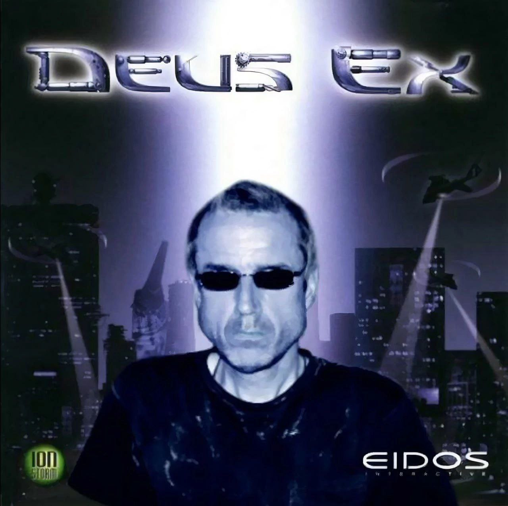

# Лабораторная работа №1

## Информация о студенте

| Поле | Значение |
|------|----------|
| **ФИО** | Давидчук Александр Юрьевич |
| **Группа** | 6402 |
| **Научный руководитель** | Савельев Дмитрий Андреевич, к.ф.-м.н., доцент кафедры технической кибернетики |
| **Предполагаемая тема диплома** | Исследование алгоритмов машинного обучения для прогнозирования цен на фондовом рынке |

## Любимая цитата

> «I've seen things you people wouldn't believe. Attack ships on fire off the shoulder of Orion. I watched C-beams glitter in the dark near the Tannhauser Gate. All those moments will be lost in time, like tears in rain. Time to die.»
> — **Roy Betty**

## Картинка

